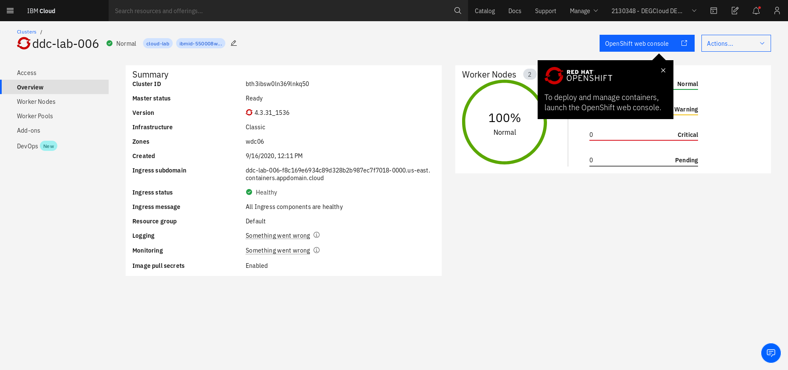
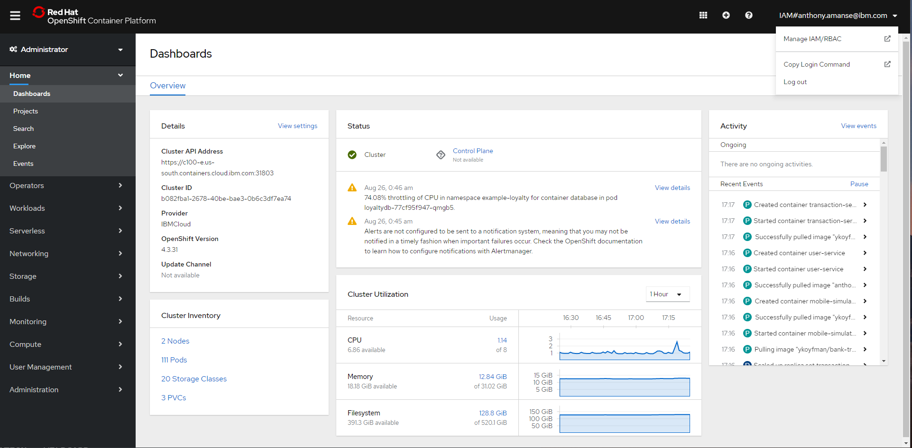

# 1. Setting up your environment

### Clone the repo

This github repository contains the source code and deployment files for this workshop.

```text
git clone https://github.com/IBM/scaling-apps-with-kafka

cd scaling-apps-with-kafka
```

### Login with OC cli

Log in with the OpenShift cluster provided for you using the OpenShift console. On the upper right corner, click your account and then click on `Copy Login Command`. This should open a new window and show you the command to login with the `oc` cli





Create a project named **food-delivery** for the resources you'll deploy.

```text
oc new-project food-delivery
```

Also, make sure you are using the **food-delivery** project.

```text
oc project food-delivery
```

