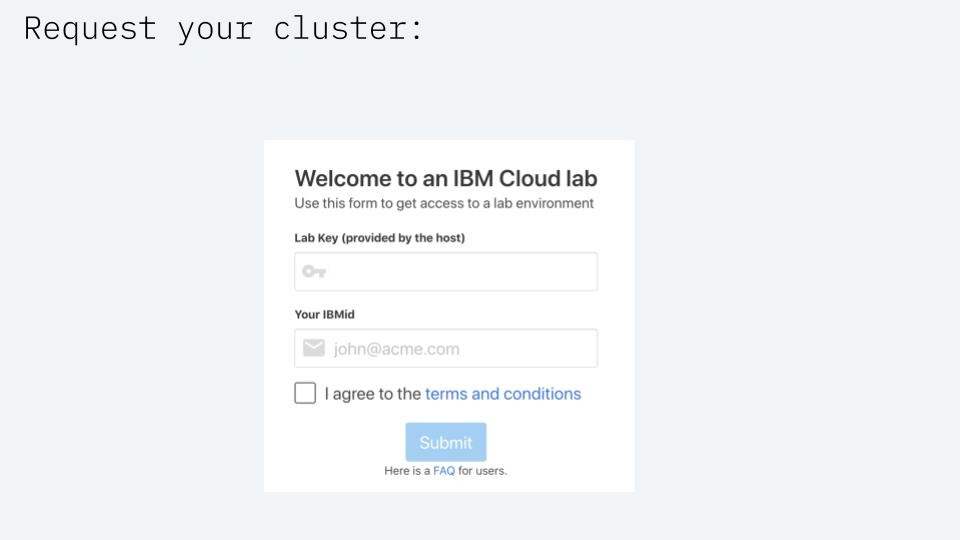
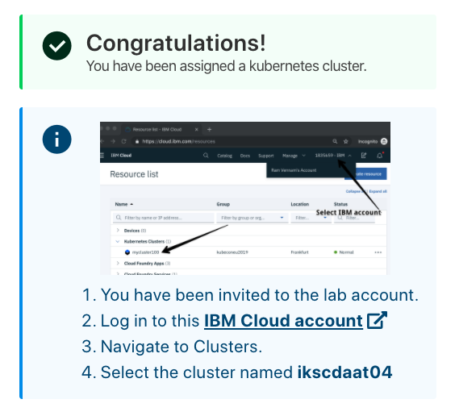
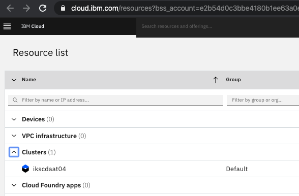
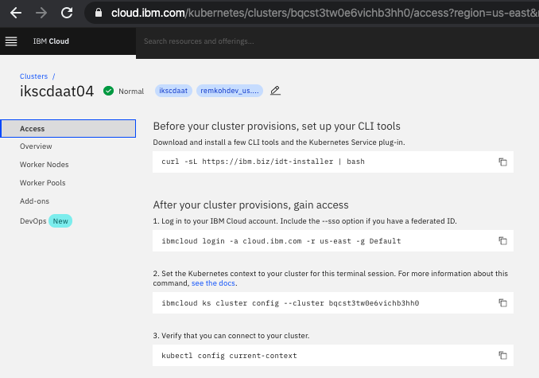
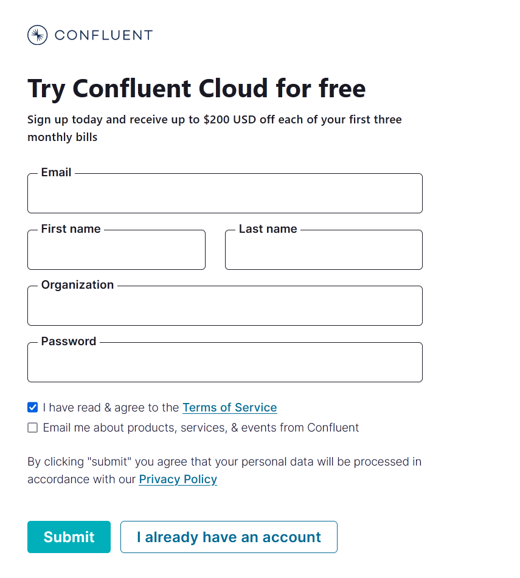
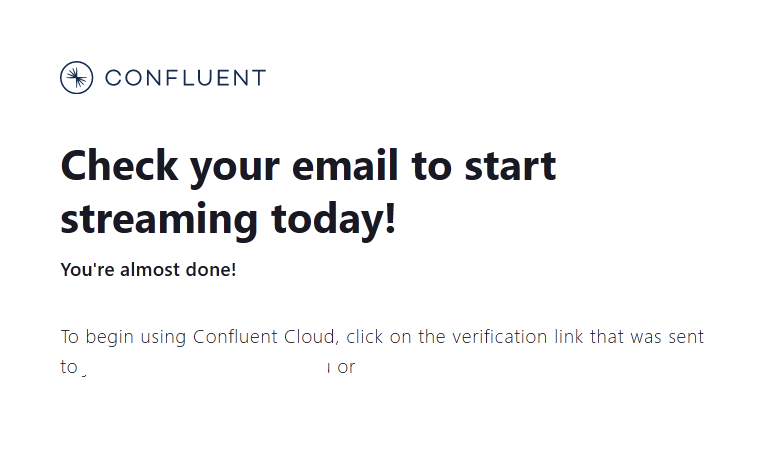

# Pre-work

### Prerequisites

* [Docker](https://www.docker.com/products/docker-desktop)
  * You'll need Docker for building and pushing container images
* [OpenShift CLI \(oc\)](https://cloud.ibm.com/docs/openshift?topic=openshift-openshift-cli#cli_oc)
  * follow Step 1 to download CLI
  * Step 2 if you also want to install kubectl

### Obtain an OpenShift cluster

#### 1. Sign up for IBM Cloud

Ensure you have an IBM Cloud ID

#### 2. Request your cluster

You will be given access to a temporary free OpenShift Cluster that was pre-created for the purpose of the workshop. The cluster will be deleted after the workshop. To gain access to this cluster:

* Open the URL [https://kafka-summit-workshop.mybluemix.net](https://kafka-summit-workshop.mybluemix.net). Lab key is **`oslab`**

* Enter the lab key \(**`oslab`**\) and your IBM Cloud account IBM id. Select the terms and conditions checkbox and click the **`Submit`** button
* You will be added to a cloud account where a cluster has been pre-provisioned for you. Click on the link in the instructions which ask you to `Log in to this IBM Cloud account`.

* If you previously logged in to the IBM Cloud, the browser will direct you to the IBM Cloud resource list view \(if you have not logged in previously, you will be asked to log in using your IBM Cloud ID\). Expand the `Clusters` section and select the cluster assigned to you \(the name will vary\).


If you don't see the cluster, make sure you select the IBM org account in the upper right corner.


* Details for your cluster will load. Click on the `Access` menu item in the left navigation column, where you can find instructions to access your cluster from the command line client.

* Note the name of your cluster, you will use this cluster for this lab.

### Create a Confluent Cloud account

You can sign up for a Confluent Cloud account on [https://confluent.cloud](https://confluent.cloud). You'll get  **$200 USD off each of your first three monthly bills.** Make sure you verify your account.


You will be asked for a **credit card** when creating a cluster on this workshop. **Don't worry!** The workload on the cluster that you'll be doing won't exceed **a dollar**! You have $200 credits to use. You can easily delete the cluster after this workshop.


