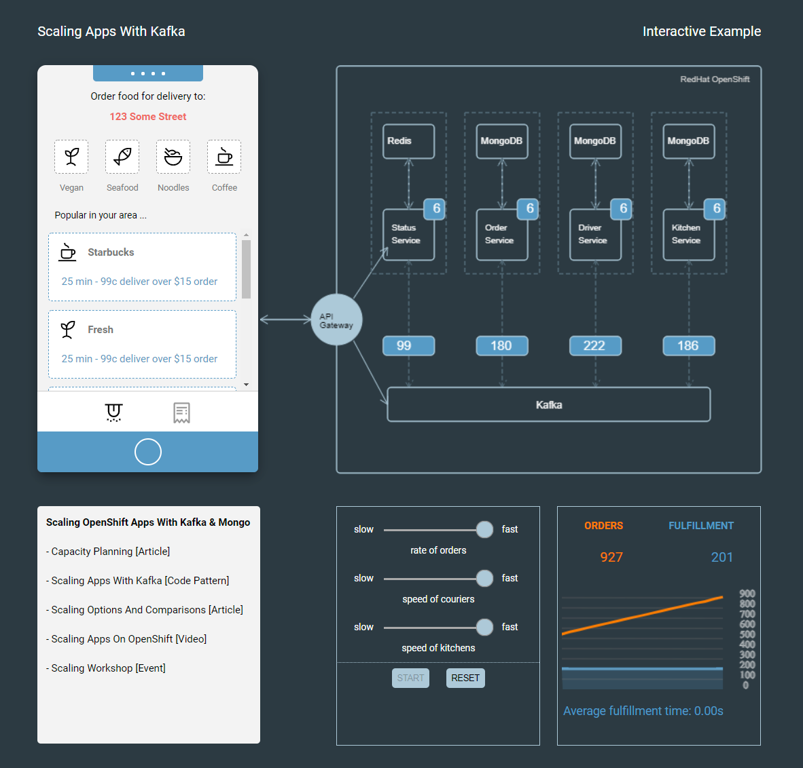

# 8. Simulate load to the Application

Access the simulator in the browser using the hostname you got from the previous step. You can now try the scenarios below to see the autoscaler in action.

You can move the sliders in the bottom section to adjust the rate of orders and speed of kitchen and couriers. The number above the microservices is the number of pods or consumers. The number below is the number of messages being consumed.

### Generate 1 order per second

Try setting it to the minimum rate of orders first. You should see the graph plot data points of orders created and orders fulfilled. At the same time, the number of pods should stay the same as the consumers can handle the 1 order per second.

### Generate 25 orders per second

Then, you can try and increase the rate of orders to the maximum. You should see the number of pods in the architecture image increase as well.

Great work! You now have deployed a Kafka event driven architecture and use a KEDA to autoscale consumers based on consumer lag.

